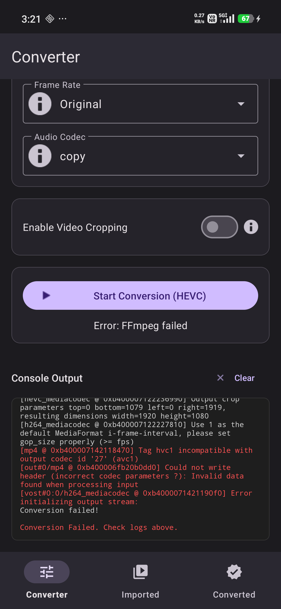

# Ren Video Converter

A high-performance, full-featured video conversion and compression application for Android. Powered by GPU acceleration and designed with modern Material 3 principles.



## 🚀 Key Features

### ⚡ Industrial-Grade Performance
- **Snapdragon Optimized:** Leverages Android's **MediaCodec API** for hardware-accelerated encoding and decoding.
- **GPU Acceleration:** High-speed, battery-efficient processing using `hevc_mediacodec` and `h264_mediacodec`.
- **Dual Engine:** Seamlessly switch between ultra-fast Hardware encoders and high-quality Software encoders (`libx264`, `libx265`, `libvpx-vp9`, `libaom-av1`).

### 🎨 Pro-Level Controls
- **Advanced Parameter Tuning:** Granular control over Resolution (up to 1080p), Bitrate, Frame Rate (60/30/24 fps), and Audio Codecs.
- **HDR & 10-bit Support:** Preserve vibrant colors with 10-bit depth (`p010le`) and BT.2020 color metadata handling.
- **Smart Cropping:** Built-in tool to trim video dimensions with precise X/Y offsets.
- **Quality Presets:** One-tap High, Medium, and Low quality presets for quick results.

### 📂 Comprehensive Media Management
- **Three-Tab Architecture:** Dedicated spaces for **Converter**, **Imported Library**, and **Converted Gallery**.
- **File Manager UI:** Professional grid and list views with real-time video thumbnails.
- **Persistent State:** Uses Jetpack ViewModel to ensure conversion tasks survive screen rotations and system events.
- **Export & Share:** Securely save to the system Gallery or share directly to other apps using FileProvider.

### 📺 Integrated Playback
- **Built-in Player:** Powered by **Android Media3 (ExoPlayer)** for seamless previewing of both source and processed files.
- **Fullscreen Experience:** Dedicated immersive player activity with standard media controls.

## 🛠️ Technical Stack
- **Language:** Kotlin
- **Video Engine:** [FFmpeg-Kit](https://github.com/sk3llo/ffmpeg-kit-flutter) (Community Fork v8.0.0 / FFmpeg 6.1+)
- **UI Framework:** Material Components (Material 3)
- **Image Loading:** Glide (for video thumbnails)
- **Player:** Media3 / ExoPlayer
- **Navigation:** Jetpack Navigation Component

## 📥 Getting Started

### Prerequisites
- Android device running **Android 8.0 (API 26)** or higher.
- Snapdragon-based device recommended for maximum hardware acceleration performance.

### Installation
1. Clone the repository:
   ```bash
   git clone https://github.com/Abungo/RenVideoConverter.git
   ```
2. Open the project in **Android Studio**.
3. Build and run on a connected device using `./gradlew installDebug`.

## 📖 Usage
1. **Import:** Go to the "Imported" tab and tap the FAB to pick a video from your device.
2. **Setup:** Select the video and go to the "Converter" tab. Choose your quality preset or enable "Advanced" for specific tweaks.
3. **Convert:** Tap "Start Conversion". Monitor real-time progress via the status bar or technical logs.
4. **Finalize:** Once finished, go to "Converted", preview your work, and tap "Export to Gallery".

## 🤝 Credits
- [FFmpeg](https://ffmpeg.org/) for the core processing power.
- [FFmpeg-Kit](https://github.com/arthenica/ffmpeg-kit) (and the Anton Karpenko fork) for the Android integration.

## 📜 License
This project is licensed under the GPL-3.0 License - see the LICENSE file for details (Note: uses FFmpeg GPL libraries).
